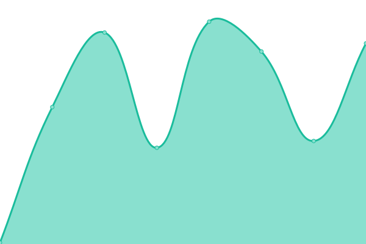

# [📈 Live Status](https://butteryoon.github.io/liveseeyou): <!--live status--> **🟧 Partial outage**

This repository contains the open-source uptime monitor and status page for [James Yoon](http://butteryoon.tistory.com), powered by [Upptime](https://github.com/upptime/upptime).

With [Upptime](https://upptime.js.org), you can get your own unlimited and free uptime monitor and status page, powered entirely by a GitHub repository. We use [Issues](https://github.com/butteryoon/liveseeyou/issues) as incident reports, [Actions](https://github.com/butteryoon/liveseeyou/actions) as uptime monitors, and [Pages](https://butteryoon.github.io/liveseeyou) for the status page.

<!--start: status pages-->
<!-- This summary is generated by Upptime (https://github.com/upptime/upptime) -->
<!-- Do not edit this manually, your changes will be overwritten -->
<!-- prettier-ignore -->
| URL | Status | History | Response Time | Uptime |
| --- | ------ | ------- | ------------- | ------ |
|  [butteryoon.github](https://butteryoon.github.io) | 🟩 Up | [butteryoon-github.yml](https://github.com/butteryoon/liveseeyou/commits/HEAD/history/butteryoon-github.yml) | 

 81ms
     
 | 

<a href="https://butteryoon.github.io/liveseeyou/history/butteryoon-github">100.00%</a>
    

|  [butteryoon.tistory](https://butteryoon.tistory.com) | 🟩 Up | [butteryoon-tistory.yml](https://github.com/butteryoon/liveseeyou/commits/HEAD/history/butteryoon-tistory.yml) | 

 2102ms
     
 | 

<a href="https://butteryoon.github.io/liveseeyou/history/butteryoon-tistory">100.00%</a>
    

|  [awsome.oci](https://awsome.duckdns.org:58803) | 🟥 Down | [awsome-oci.yml](https://github.com/butteryoon/liveseeyou/commits/HEAD/history/awsome-oci.yml) | 

 0ms
     
 | 

<a href="https://butteryoon.github.io/liveseeyou/history/awsome-oci">0.00%</a>
    

|  [iWillSystems](http://www.iwsys.co.kr) | 🟥 Down | [i-will-systems.yml](https://github.com/butteryoon/liveseeyou/commits/HEAD/history/i-will-systems.yml) | 

 0ms
     
 | 

<a href="https://butteryoon.github.io/liveseeyou/history/i-will-systems">0.00%</a>
    

|  [LiveSeeYou](https://www.liveseeyou.com) | 🟥 Down | [live-see-you.yml](https://github.com/butteryoon/liveseeyou/commits/HEAD/history/live-see-you.yml) | 

 0ms
     
 | 

<a href="https://butteryoon.github.io/liveseeyou/history/live-see-you">0.00%</a>
    

|  [LiveStream](https://live.uplus.co.kr) | 🟥 Down | [live-stream.yml](https://github.com/butteryoon/liveseeyou/commits/HEAD/history/live-stream.yml) | 

 0ms
     
 | 

<a href="https://butteryoon.github.io/liveseeyou/history/live-stream">0.00%</a>
    

|  [LiveStream(dev)](https://devlive.uplus.co.kr:8080) | 🟥 Down | [live-stream-dev.yml](https://github.com/butteryoon/liveseeyou/commits/HEAD/history/live-stream-dev.yml) | 

 0ms
     
 | 

<a href="https://butteryoon.github.io/liveseeyou/history/live-stream-dev">0.00%</a>
    

|  [LiveStreamK(IWS)](http://iws.iptime.org:8080) | 🟥 Down | [live-stream-k-iws.yml](https://github.com/butteryoon/liveseeyou/commits/HEAD/history/live-stream-k-iws.yml) | 

 0ms
     
 | 

<a href="https://butteryoon.github.io/liveseeyou/history/live-stream-k-iws">0.00%</a>
    

<!--end: status pages-->

[**Visit our status website →**](https://butteryoon.github.io/liveseeyou)

## 📄 License

- Code: [MIT](./LICENSE) © [James Yoon](http://butteryoon.tistory.com)
- Data in the `./history` directory: [Open Database License](https://opendatacommons.org/licenses/odbl/1-0/)
